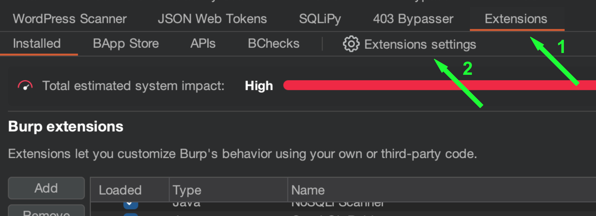
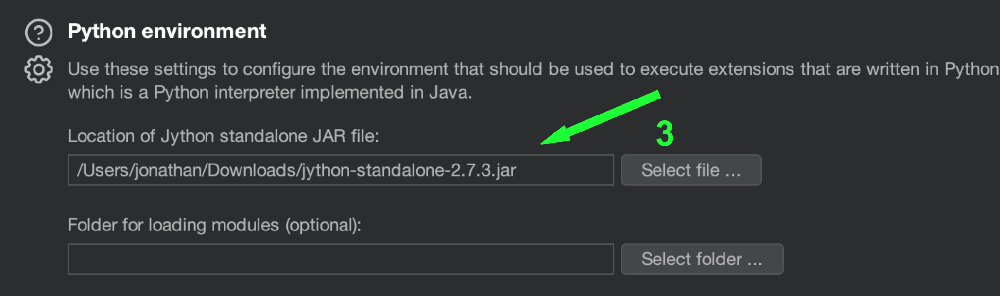
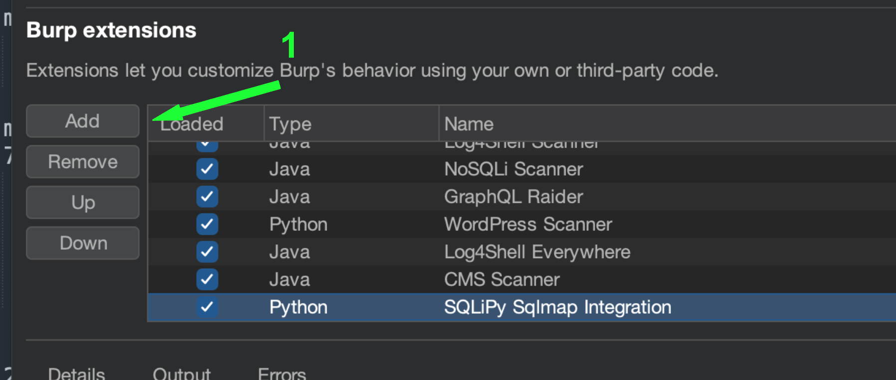
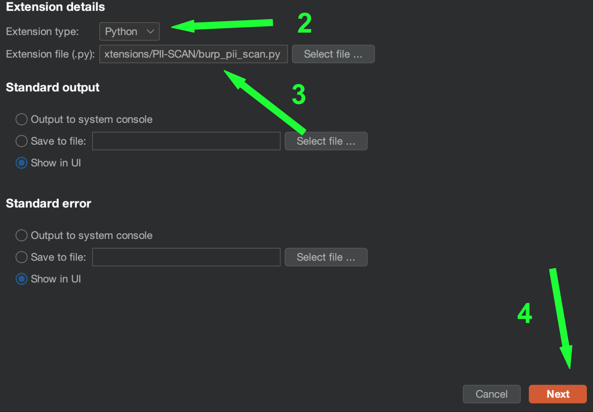
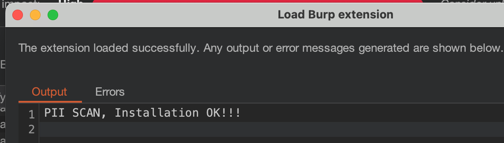
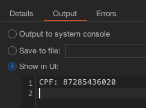
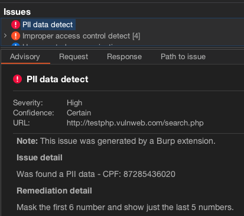

---

# **SecureSearch** - Comprehensive Sensitive Data Scanner

**SecureSearch** é uma extensão completa para o Burp Suite, projetada para identificar e registrar dados sensíveis como CPF, e-mail, número de cartão de crédito, data de nascimento, telefone celular, RG e possíveis senhas. Ele ajuda a proteger informações críticas, garantindo que nenhuma delas seja exposta indevidamente durante o tráfego de rede.

## Tabela de Conteúdos

- [Instalação](#instalação)
- [Uso](#uso)

## Instalação

1. Baixe o [Jython](https://www.jython.org/download) standalone JAR, por exemplo, a versão [2.7.3](https://repo1.maven.org/maven2/org/python/jython-standalone/2.7.3/jython-standalone-2.7.3.jar).
2. Vá até **Extensions -> Extensions settings** e defina o caminho no campo `Location of Jython standalone JAR file` no ambiente Python.

   

   

3. Extraia o arquivo `SecureSearch.zip`.
4. Vá até **Extensions -> Installed** no Burp. Clique em **Add**. Defina o `Extension type` como `Python`, selecione o arquivo `burp_securesearch.py` em `Extension file` e clique em **Next**.

   

   

   

## Uso

Após a [instalação](#instalação) da extensão, navegue pelos sites utilizando o proxy do Burp. O **SecureSearch** identificará e registrará automaticamente quaisquer dados confidenciais encontrados, gerando logs no console e criando alertas no Burp Suite com recomendações para correção.

### Dados Sensíveis Verificados:
- CPF
- E-mail
- Número de cartão de crédito
- Data de nascimento
- Telefone celular
- RG
- Possíveis senhas

Quando o **SecureSearch** detectar dados sensíveis, ele gerará um log no console e criará uma nova questão no Burp Suite com informações detalhadas sobre o vazamento e as medidas de remediação.

---

Agora com o nome **SecureSearch**, o projeto transmite a ideia de uma busca eficiente por segurança. Me avise se precisar de mais ajustes!